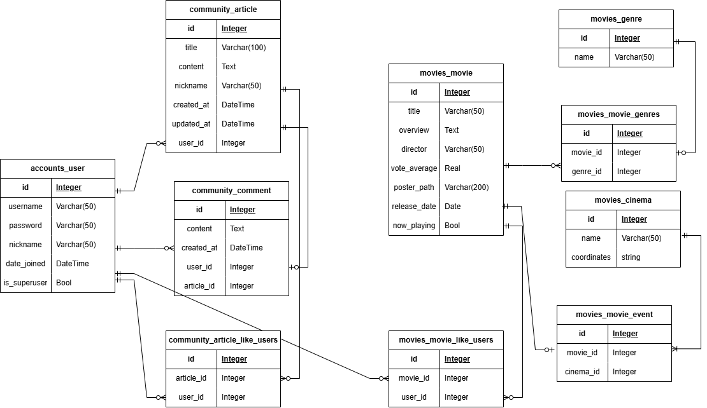

# 📽 굿즈 기반 영화 추천 및 커뮤니티, 무비덕후 프로젝트

## 🌟 프로젝트 소개
사용자 위치와 재고 수량 정보를 기반으로, 현재 상영 중인 영화와 관련된 굿즈 및 이벤트 정보를 추천하며, 영화관별 상영 영화 및 영화 커뮤니티 기능을 제공하는 웹 사이트입니다.  
해당 프로젝트는 사용자 친화적인 인터페이스와 효율적인 추천 알고리즘으로, 영화 팬들에게 최적화된 경험을 제공하는 것을 목표로 삼았습니다.

---

## 🧑‍💻 팀원 정보 및 업무 분담

| 역할            | 이름 | 주요 업무                                         |
|----------------|------|------------------------------------------------|
| **백엔드 개발자** | 김승우 | - 영화 추천 알고리즘 개발 - 영화 검색 알고리즘 개발 - API 연동 및 데이터 처리 - 데이터베이스 모델링 및 구현 - 백엔드 전반(회원관리, 게시판, 좋아요 등) |
| **프론트엔드 개발자** | 이가희 | - 웹 디자인 및 CSS - 회원가입 및 로그인 기능 구현 - 게시판 UI 및 CRUD 기능 구현 - 영화 리스트 및 상세 정보 UI 구현 |

---

## 🎯 목표 서비스 구현 및 실제 구현 정도
### 목표:
1. 사용자 위치와 영화 굿즈 재고를 기반으로한 영화 추천 알고리즘 제공
2. TMDB API를 활용한 영화 데이터 활용
3. 영화 커뮤니티 게시판 기능
4. 회원가입, 로그인, 마이페이지, 좋아요 기능

### 구현 완료 목록:
✅ 사용자 위치 및 영화관별 정보 기반 영화 추천  
✅ TMDB API 및 영화관 이벤트/굿즈 API 연동  
✅ 로그인/로그아웃 및 회원가입/수정 기능  
✅ 게시판 CRUD 및 좋아요/댓글 기능  
✅ 마이페이지에서 내가 쓴 글, 좋아요한 영화 확인 및 관리  
✅ 영화 제목 검색 기능  

---

## 📊 데이터베이스 모델링(ERD)

## 🔍 영화 추천 알고리즘 기술

## 💡 핵심 기능
### 1. 사용자 위치와 재고 수량 기반 영화 추천
- 사용자 위치 정보를 활용하여 가까운 영화관 및 추천 영화 목록 제공.  
- 영화관 이벤트 및 굿즈 재고와 연결된 맞춤형 추천 시스템.  

### 2. 전체 영화 페이지
- TMDB API를 활용한 영화 데이터 제공
- 검색창을 통해 영화 제목으로 검색 가능
- 영화 클릭 시 영화 정보 상세 페이지로 이동

### 3. 현재 상영 중인 영화 페이지
- API를 통해 상영 영화 목록 제공
- 영화 클릭 시 영화 정보 상세 페이지로 이동

### 3. 영화 상세 페이지
- 제목, 줄거리, 감독, 개봉일, 러닝타임, 평점 등의 상세 정보 제공
- 영화 상세 정보를 표시하며 좋아요 버튼을 제공
- 좋아요를 누른 영화는 마이페이지에서 확인 가능 

### 4. 커뮤니티 기능
- **게시판**: 게시글 작성, 조회, 수정, 삭제
- **댓글**: 게시글에 댓글 작성, 삭제 가능
- 로그인된 사용자만 게시판 및 댓글 기능 사용 가능

### 5. 마이페이지
- 내가 작성한 게시글을 확인 
- 회원정보 수정 및 좋아요한 영화 목록 제공

## 🤖 생성형 AI 활용
- UI 디자인 아이디어를 생성형 AI를 통해 도출

## 💭 느낀 점

- **이가희**: Vue.js의 Composition API와 script setup문법을 활용하여 더 간결하고 효율적인 코드를 작성할 수 있었습니다. 기획한 서비스를 직접 구현해나가며 초기 설계 단계에서 컴포넌트 구조 설계의 중요성을 크게 느꼈습니다. 또한 UI 디자인도 초기에 꼼꼼하게 만들어두면 실제 구현할 때 컴포넌트의 재사용 측면에 있어 편리할 것 같습니다.  
컴포넌트 구조를 설계하고, 그 위에 화면을 쌓아나가고, 최종적으로 사용자에게 보이게 될 사소한 부분들까지 디자인 하는 과정에서 직접 사용자와 만나게 되는 부분을 개발할 수 있어 즐거웠고, 특히 Back-end와 연결하여 실제 데이터베이스를 가지고 구현하니 서비스가 살아움직이는 것 같은 느낌을 받을 수 있었습니다.
- **김승우**: 

